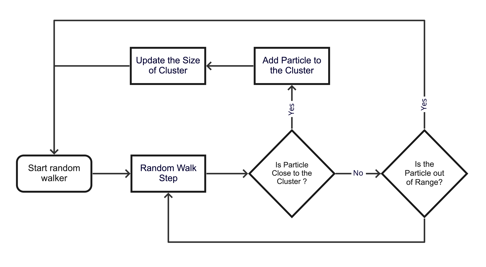
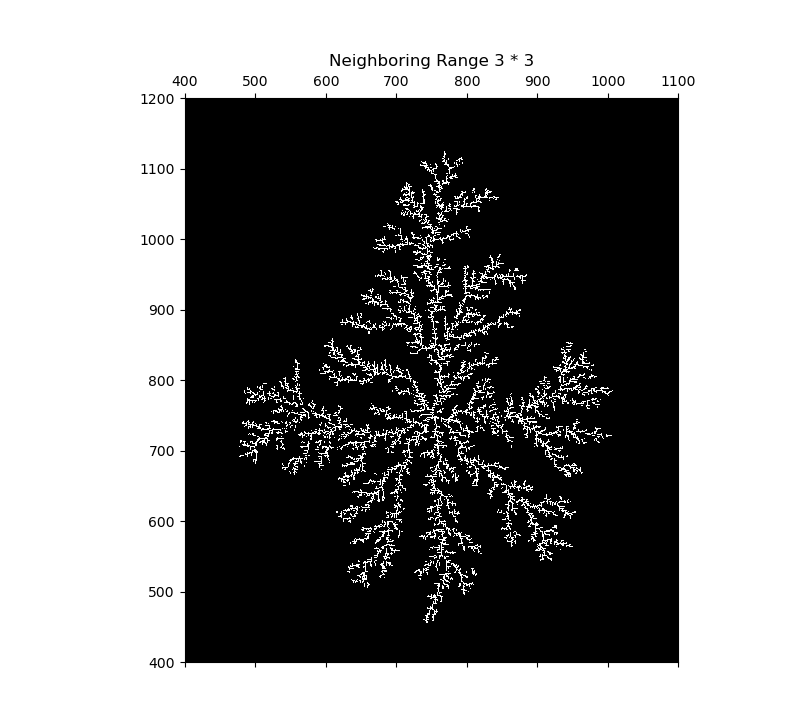
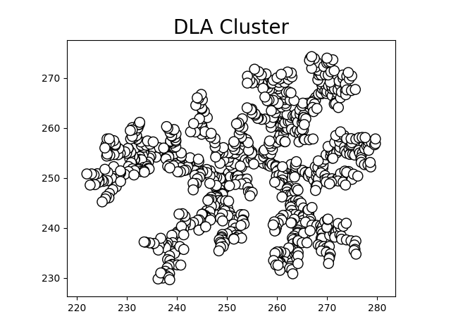
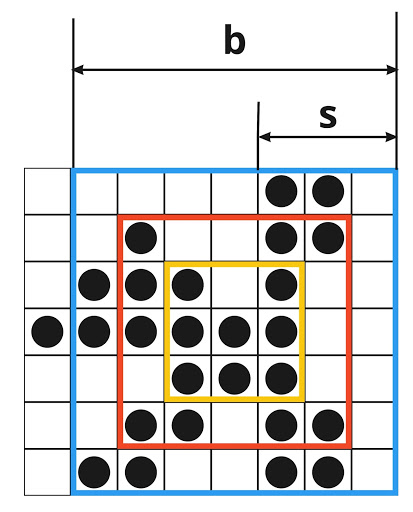
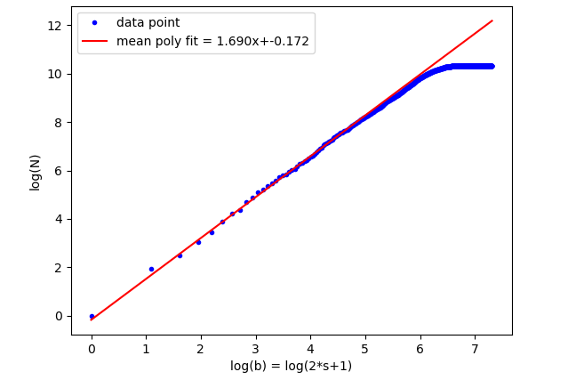

# DLA-simulator

#### Introduction

This project focus on the computer simulation on diffusion-limited aggregation model, which is originally proposed by Witten and Sander in 1983. Diffusion-limited aggregation model is one type of fractal growth model with are a class of phenomena which produce self-similar, disordered objects in the course of development far from equilibrium.

We provide both on-lattice and off-lattice simulator written in python. We also include several jupyter notebooks to analysis the fractal dimension of the cluster for both on-lattice and off-lattice simulation.

#### Project Structure
1. [On-lattice simulation](on_lattice/):
    * [Simulator](on_lattice/on_lattice_cluster.py): The code to run the simulation with command `python on_lattice_cluster.py`
    * [Analysis](on_lattice/analysis/AnalysisOnLattice.ipynb): Analysis of fractal dimension
    * [Results](on_lattice/analysis/Summary.ipynb): A summary of data which including python code for plotting the data
    * [Data](on_lattice/result/): This directory includes both the cluster represented by numpy ndarray as well as some graph of cluster and fractal dimension generated
2. [Off-lattice simulation](off_lattice/):
    * [Simulator](off_lattice/simulator/): 
        * The code directory contains a cluster object file and a particle object file.
        * To run the simulation using the command `python off_lattice_cluster.py`
    * [Analysis](off_lattice/analysis/AnalysisOnLattice.ipynb): Analysis of fractal dimension
    * [Results](off_lattice/analysis/Summary.ipynb): A summary of data which including python code for plotting the data
    * [Data](off_lattice/result/): This directory includes both the cluster represented by numpy ndarray as well as some graph of cluster and fractal dimension generated
   
#### Demo
The following flowchart shows a simple version of basic idea behind the DLA simulation:

After the simulation, we would obtain some cluster like the following graph:

##### On-lattice

##### Off-lattice

The fractal dimension is measure by counting the number of particle within certain range. The following graph shows the on-lattice measurement using a box.

As a result of fractal dimension measurement, we would obtain a plot of number of particle with respect to the size of box, like

#### Reference
1. L. M. Sander, “Fractal growth processes,” inMathematics of Complexity and Dynamical Sys-tems, edited by R. A. Meyers (Springer New York, New York, NY, 2011) pp. 429–445.
2. T. A. Witten and L. M. Sander, Phys. Rev. B27, 5686 (1983).
3. I. R. Nogueira, S. G. Alves,  and S. C. Ferreira, Physica A: Statistical Mechanics and itsApplications390, 4087 (2011).
4. “Fractal dimension,”https://en.wikipedia.org/wiki/Fractal_dimension(2021).
    
